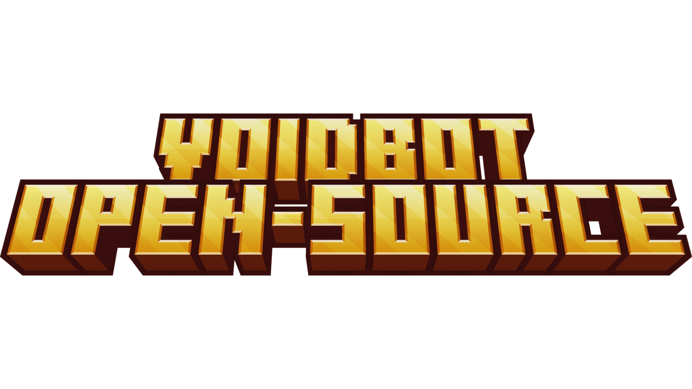

***

## VoidBot open-source
#### VoidBot open-source is a discord bot that you can suggest edits for the real bot or copy the code and use them for your bot. Make sure to read the [`LICENCE`](https://github.com/Death1Clown/VoidBot_open-source/blob/main/LICENSE.md)

***

